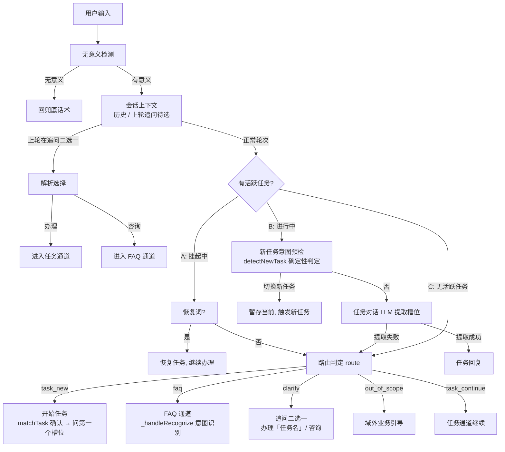
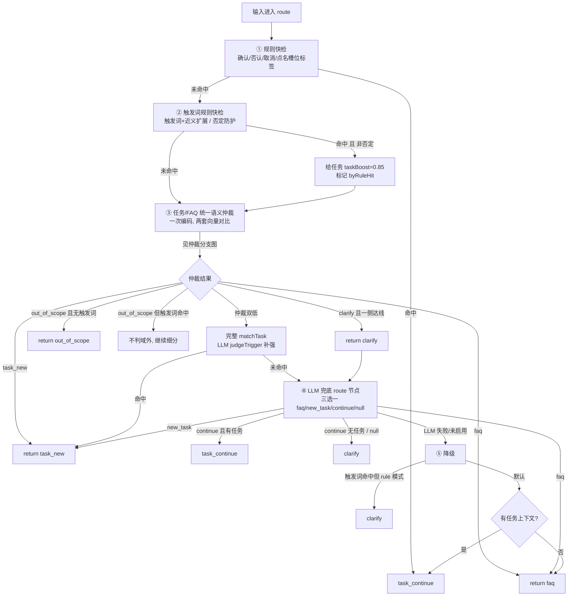
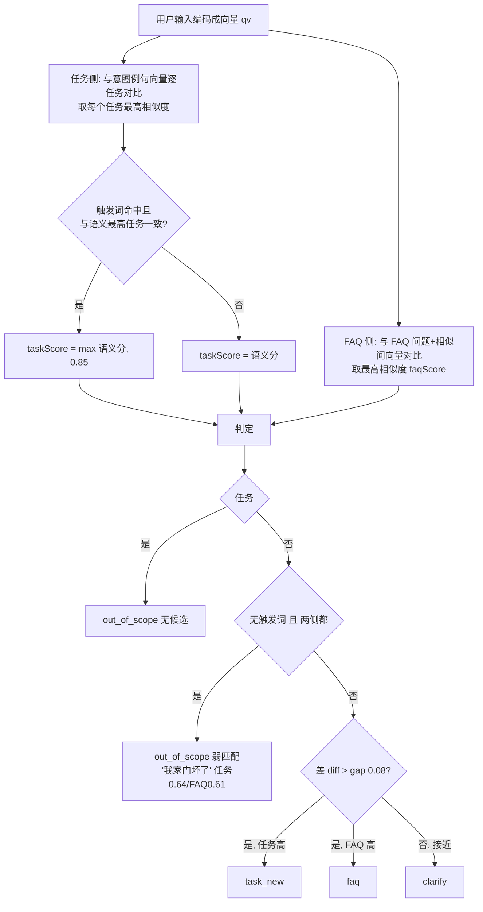
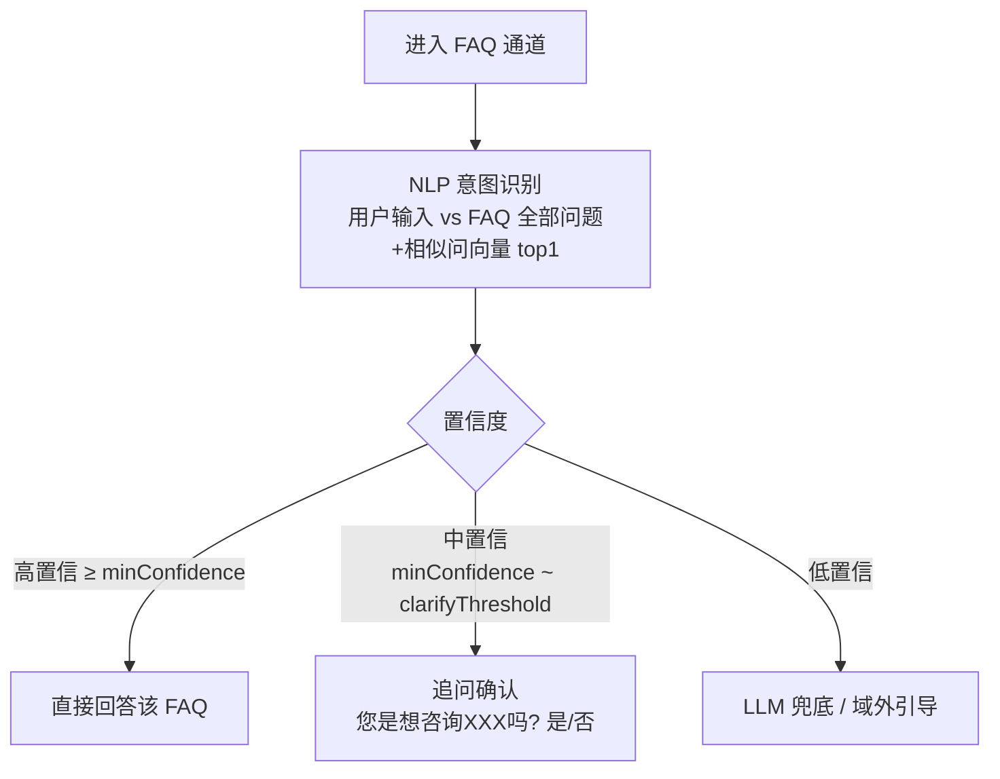

# 路由判定：一个问题进来，系统如何判断走 FAQ / 任务 / 域外

> 核心链路：`faq-engine.chat()` → `nlu.route()`（5 层递进判定）→ 各通道处理
> 相关代码：`faq-engine.js` / `services/taskflow/nlu.js`（route / arbitrateTaskFaq / matchTask）

---

## 一、整体流程（总览图）

---

## 二、路由判定 `route()` —— 5 层递进

---

## 三、仲裁（arbitrateTaskFaq）判定分支

---

## 四、各通道后续处理

| route 返回 | 处理 | 走向 |
|---|---|---|
| `task_new` | `_tryStartTask`：matchTask 确认任务 → `startTask` → 问第一个槽位 | 任务流程 |
| `faq` | `_handleRecognize`：FAQ 意图识别（见下） | FAQ 回答 |
| `clarify` | 追问二选一：*"您是想办理「任务名」业务，还是想咨询其他问题呢？"* | 用户选择后再路由 |
| `out_of_scope` | 域外引导话术（"您的问题超出我的服务范围…"） | 结束 |
| `task_continue` | 任务通道继续（规则版步骤机 / LLM 版对话） | 任务流程 |

---

## 五、FAQ 通道内部（_handleRecognize）

---

## 六、三个例子走一遍

| 用户输入 | 触发词 | 任务侧 | FAQ 侧 | 判定链 | 结果 |
|---|---|---|---|---|---|
| "换表怎么办理" | ✅ 命中"换表" | 0.82 → 抬升 **0.85** | 0.71 | 触发词命中→抬升→差 0.136>gap | **task_new** → 开始换表任务 |
| "滤芯多久换一次" | ❌ | 0.51 | **0.90**（滤芯 FAQ） | FAQ 达强命中且更高 | **faq** → 直接答 |
| "我家门坏了" | ❌ | 0.64 | 0.61 | 无触发词 + 双低 <0.8 | **out_of_scope** → 域外引导 |
| "上门维修多少钱" | ❌ | 0.52 | 0.58 | 无触发词 + 双低 <0.8 | **out_of_scope** |

---

## 七、仲裁对比的数据与阈值（可配）

**对比的数据**：
- 任务侧：任务的**意图例句**（`intent_examples`）编码的向量（只有配了例句的任务参与语义仲裁）
- FAQ 侧：**FAQ 的问题 + 相似问**（`recognizer.allSamples`）编码的向量
- 触发词：`trigger_keywords` + 近义扩展（确定性信号，独立于向量）

**判定阈值**（`sys_config` 可配，任务级 `arb_*` 可覆盖）：

| 阈值 | 默认 | 作用 |
|---|---|---|
| `arb_task_min` | 0.45 | 任务侧候选最低线 |
| `arb_faq_min` | 0.55 | FAQ 侧候选最低线 |
| `arb_strong_hit` | 0.80 | 强命中线（无触发词时双低=弱匹配→域外） |
| `arb_gap` | 0.08 | 强命中后两侧差距（>gap 判胜出，否则澄清） |
| `arb_task_boost` | 0.85 | 触发词命中时的任务侧抬升分 |

---

## 八、一句话总结

**判断顺序 = 确定性规则（确认/取消/触发词）→ 语义仲裁（任务例句 vs FAQ 例句的向量相似度）→ LLM 兜底 → 降级**。判 FAQ 还是任务，本质是"用户输入更接近哪套配置例句"；判 out_of_scope 是"两个都不够像且没有触发词"（保守不误触发）。
